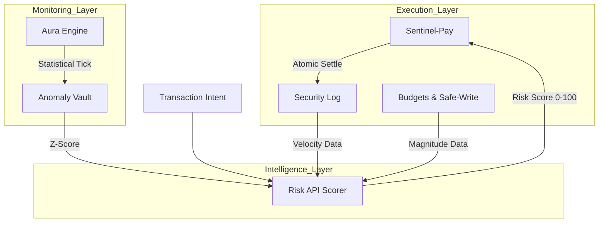

# 🛡️ Sentinel-Pay: Sovereign Agentic Commerce Governance

[](https://nextjs.org/)
[](https://www.python.org/)
[]()


**Sentinel-Pay** is a high-integrity governance layer for autonomous agents operating in the global economy. Built on the principle of **Deterministic Safety**, it provides a "Reliability Shield" that ensures agents never exceed their mandates, double-spend, or corrupt the underlying financial ledger.

---

## 🏗️ System Architecture & Data Flow



---

## 🛡️ The Reliability Shield

At the core of Sentinel-Pay is the three-pillar **Reliability Shield**, designed for 100% data integrity even in high-concurrency environments.

### 1. 🔄 Idempotency Engine
Prevent double-spending. Each transaction is uniquely identified by a `request_id`. Our engine caches results in `idempotency_store.json`, ensuring that even if a network retry occurs or an agent double-fires, the budget is only impacted once.

### 2. ⚛️ Atomic Safe-Write
Financial data is precious. We use an **MSVCRT-locked**, temp-swap pattern to update `budgets.json`.
- **The Protocol**: Lock → Read → Modify → Write `.tmp` → Sync/Flush → `os.replace`.
- **The Result**: Zero file corruption, even if the system crashes mid-transaction.

### 3. 🧾 Deterministic Audit Trail
Every action (AUTHORIZATION, SETTLEMENT, REVOCATION, RETRIES) is captured in a high-fidelity JSON-structured log (`security.log`). This enables real-time monitoring and exhaustive post-mortem forensic analysis.


---

## 🧠 Risk Intelligence Architecture (v1.0)

Sentinel-Pay includes a standalone **Risk API** (`/risk_api`) that evaluates every transaction intent before it reaches the settlement layer.

### Multi-Factor Evaluation Engine
The `scorer.py` engine calculates a weighted risk score (0-100) based on three critical factors:
1. **Anomaly (40%)**: Statistical $Z$-score from the **Aura Engine**, using **Welford's Algorithm** for real-time monitoring.
2. **Velocity (30%)**: Transaction frequency for the `agent_id` within a rolling 10-minute window.
3. **Magnitude (30%)**: The transaction amount relative to the agent's total authorized budget.

### Governance Logic (Reason Codes)

| Code | Label | Logic Pattern | Threshold |
| :--- | :--- | :--- | :--- |
| **R01** | High Velocity | `tx_count > 5` in last 10m | 30% Weight |
| **R02** | High Z-Score | `amount > mean + 3.0σ` | 40% Weight |
| **R03** | Large Magnitude | `amount > 70%` of remaining budget | 30% Weight |
| **T01** | Hard Block | `Total Score > 85` | Final DENY |
| **T02** | Soft Decline | `Total Score 70 - 85` | Admin REVIEW |

---

## 🚀 Developer Quickstart

Get the Sentinel-Pay governance stack running in under 2 minutes.

### 1. Initialize Environments

```bash
# Python Backend & Risk API
pip install pydantic httpx fastapi uvicorn

# Next.js Frontend
npm install
```

### 2. Launch Services
```bash
# Start the components in sequence:
python -m risk_api.main        # Risk Evaluation Layer
python mock_server.py          # Mock Merchant Server
npm run dev                    # Governance Dashboard
```

Navigate to `http://localhost:3000` to view the **Real-time Security Audit** and **Agent Governance** portal.

---

## 🛠️ Technical Specifications

- **Security Core (`sentinel.py`)**: Primary logic engine for pre-auth and atomic settlement.
- **Risk Intelligence (`risk_api/`)**: Standalone FastAPI service with **1.58ms average latency**.
- **Aura Engine (`aura_engine/`)**: Real-time statistical monitor for anomaly detection (Observe -> Orient -> Decide -> Act).
- **Merchant Gateway (`gateway.py`)**: Handles the merchant notification protocol with retry logic.
- **Governance UI**: Built with **Next.js 16**, **Tailwind CSS**, and **Shadcn/UI** for a premium "Fintech Clean" aesthetic.

---

## 🔍 UI Showcase & Governance Demo

### Real-time Registry
Maintain a sovereign source of truth for all agentic budgets.


### Intelligent Budget Controls
Visual safety locks prevent budget depletion and ensure agent liquidity.


---

## 🔍 Security Guardrails

> [!IMPORTANT]
> **Zero Hardcoding**: Always use environment variables for keys.  
> **Fail-Safe Defaults**: If any check results in an `UNKNOWN` state, the sentinel defaults to a hard **DENY**.  
> **Mandatory Input Validation**: Every external intent is strictly schema-validated via Pydantic v2 before entering the pre-auth stage.

---

Built for the next generation of autonomous builders. **Governance is the new Vibe.** 📈🛡️
