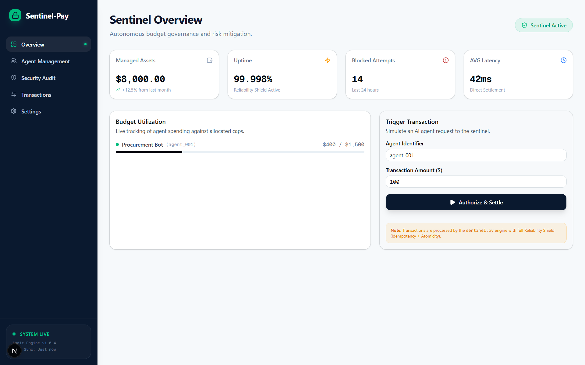
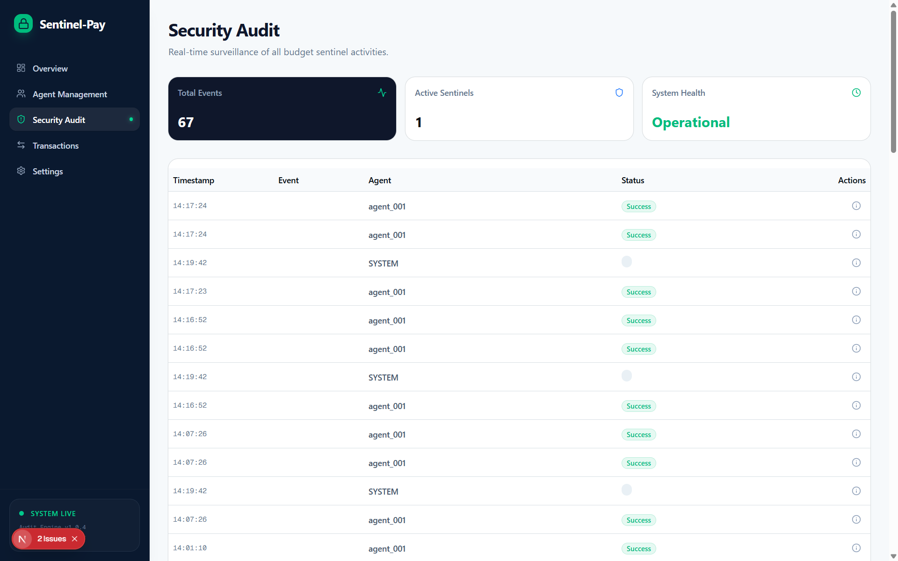
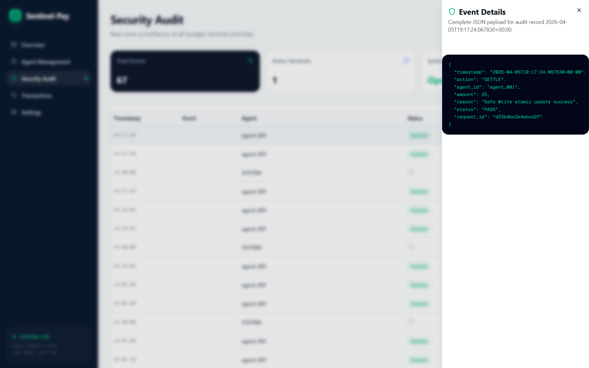
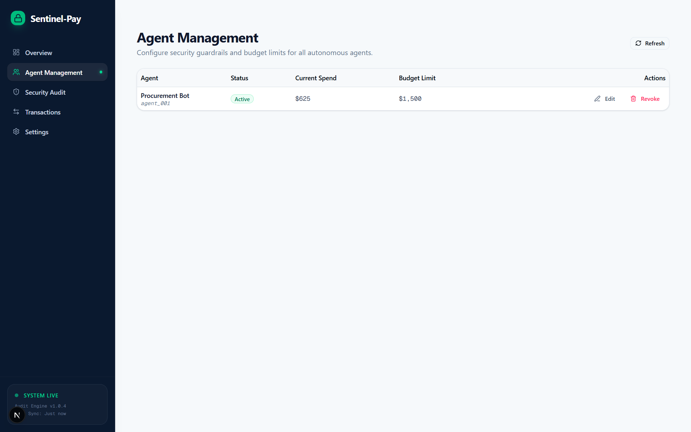
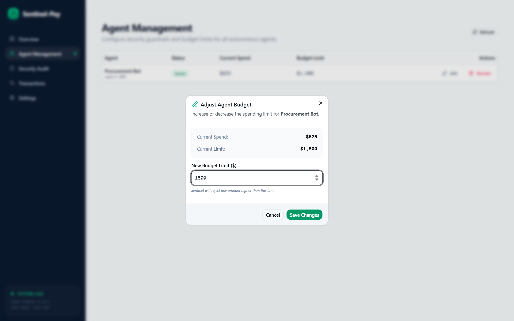
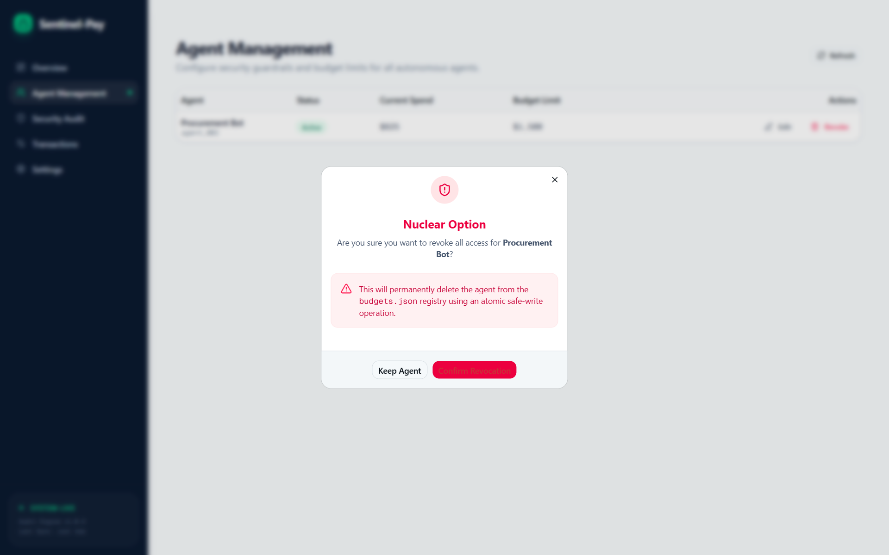

# 🛡️ Sentinel-Pay: Sovereign Agentic Commerce Governance

[](https://nextjs.org/)
[](https://www.python.org/)
[]()



**Sentinel-Pay** is a high-integrity governance layer for autonomous agents operating in the global economy. Built on the principle of **Deterministic Safety**, it provides a "Reliability Shield" that ensures agents never exceed their mandates, double-spend, or corrupt the underlying financial ledger.

---

## 🏛️ The Philosophy of Win-Win-Win

We believe the future of commerce belongs to autonomous agents. However, that future requires a new social contract of trust:

- **For Platforms**: Zero credit risk. Sentinel-Pay ensures that every transaction is pre-authorized against a hard-coded or dynamically governed budget limit.
- **For Developers**: Infinite scalability. Agents can focus on complex strategies without needing to manage ledger-level concurrency or safety logic.
- **For Merchants**: Guaranteed settlement. Every intent processed through the sentinel is atomically committed, idempotently safe, and merchant-notified before finality.

---

## 🛡️ The Reliability Shield

At the core of Sentinel-Pay is the three-pillar **Reliability Shield**, designed for 100% data integrity even in high-concurrency environments.

### 1. 🔄 Idempotency Engine

Prevent double-spending. Each transaction is uniquely identified by a `request_id`. Our engine caches results in `idempotency_store.json`, ensuring that even if a network retry occurs or an agent double-fires, the budget is only impacted once.

### 2. ⚛️ Atomic Safe-Write

Financial data is precious. We use an **MSVCRT-locked**, temp-swap pattern to update `budgets.json`.

- **The Protocol**: Lock → Read → Modify → Write `.tmp` → Sync/Flush → `os.replace`.
- **The Result**: Zero file corruption, even if the system crashes mid-transaction.

### 3. 🧾 Deterministic Audit Trail

Every action (AUTHORIZATION, SETTLEMENT, REVOCATION, RETRIES) is captured in a high-fidelity JSON-structured log (`security.log`). This enables real-time monitoring and exhaustive post-mortem forensic analysis.




---

## 🧠 Risk Intelligence Architecture (v1.0)

Sentinel-Pay includes a standalone **Risk API** (`/risk_api`) that evaluates every transaction intent before it reaches the settlement layer.

### Multi-Factor Evaluation Engine
The `scorer.py` engine calculates a weighted risk score (0-100) based on three critical factors:
1. **Anomaly (40%)**: Statistical $Z$-score from the **Aura Engine**, detecting spending outliers in real-time.
2. **Velocity (30%)**: Transaction frequency for the specific `agent_id` within a rolling 10-minute window.
3. **Magnitude (30%)**: The transaction amount relative to the agent's total authorized budget.

### Dynamic Thresholding
- **Score < 70 (APPROVE)**: Transaction proceeds to the Reliability Shield.
- **Score 70-85 (REVIEW)**: "Soft Decline" — requires manual administrative override.
- **Score > 85 (BLOCK)**: "Hard Block" — immediate rejection and security audit event.

---

## 🚀 Developer Quickstart

Get the Sentinel-Pay governance stack running in under 2 minutes.

### 1. Initialize Environments

```bash
# Python Backend & Risk API
pip install pydantic httpx fastapi uvicorn

# Next.js Frontend
npm install
```

### 2. Launch Services
```bash
# 1. Start the Risk API
python -m risk_api.main

# 2. Start the Mock Merchant Server (Testing Gateway)
python mock_server.py

# 3. Start the Sentinel-Pay Dashboard
npm run dev
```

---

## 🛠️ System Architecture

- **Security Core (`sentinel.py`)**: The primary logic engine for pre-auth and atomic settlement.
- **Risk Intelligence (`risk_api/`)**: Standalone FastAPI service for real-time transaction scoring (< 50ms latency).
- **Aura Engine (`aura_engine/`)**: Real-time statistical monitor for anomaly detection (Observe -> Orient -> Decide -> Act).
- **Merchant Gateway (`gateway.py`)**: Handles the merchant notification protocol with mandatory retry logic.
- **Governance UI**: Built with **Next.js 16**, **Tailwind CSS**, and **Shadcn/UI** for a premium "Fintech Clean" aesthetic.

---

## 🔍 UI Showcase & Governance Demo

### Real-time Registry
Maintain a sovereign source of truth for all agentic budgets.



### Intelligent Budget Controls
Visual safety locks prevent budget depletion and ensure agent liquidity.




---

## 🔍 Security Guardrails

> [!IMPORTANT]
> **Zero Hardcoding**: Always use environment variables for keys.  
> **Fail-Safe Defaults**: If any check results in an `UNKNOWN` state, the sentinel defaults to a hard **DENY**.  
> **Mandatory Input Validation**: Every external intent is strictly schema-validated via Pydantic v2 before entering the pre-auth stage.

---

Built for the next generation of autonomous builders. **Governance is the new Vibe.** 📈🛡️
